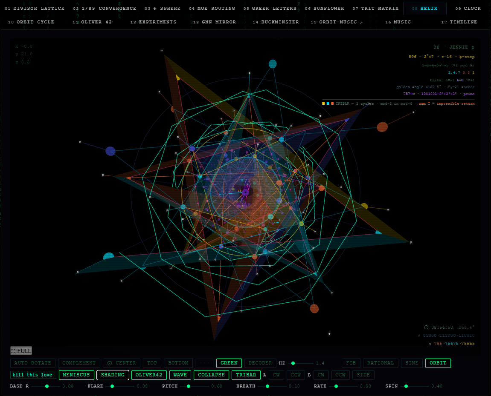

# LiKeJennie

**Live:** [fib896.com](https://fib896.com)

A WebGL visualization of the ×2 mod 9 doubling orbit — six numbers
wound around a Fibonacci phyllotaxis cone, breathing.

---

[](https://fib896.com)

## What It Shows

Start at 1. Double it. Take the result mod 9. Repeat:

```
1 → 2 → 4 → 8 → 7 → 5 → 1 → ...
```

Six values. Period 6. The numbers 3, 6, and 9 are structurally excluded —
they form their own closed system under ×2 mod 9 and never enter this orbit.
**9 does not appear.**

Each value has an echo: its complement summing to 9 (1↔8, 2↔7, 4↔5). The
visualization runs two helix strands π radians apart — Strand A carries the
orbit, Strand B carries the echoes. Every rung connects a node to its echo
across the axis.

Labels are written in **balanced ternary centered on 6**: digits 5=−1, 6=0, 7=+1.
The zero of the trit system is 6 — the nil element, the number that isn't
there. The arc at step 21 (Fibonacci F₈) is where the golden-angle spiral
nearly closes on itself: the next structure to build.

---

## Scenes

| Tab | Panel | Description |
|-----|-------|-------------|
| 01 | DIVISOR LATTICE | 896 = 2⁷×7 divisor structure |
| 02 | 1/89 CONVERGENCE | 1/89 = ΣF(n)/10ⁿ⁺¹ convergence |
| 03 | φ SPHERE | Fibonacci/Lucas nodes on a unit sphere |
| 04 | MoE ROUTING | Kimi K3 mixture-of-experts token routing |
| 05 | GREEK LETTERS | π, φ, τ, ω — connections to 896 |
| 06 | SUNFLOWER | Golden angle phyllotaxis disc |
| 07 | TRIT MATRIX | Balanced ternary digit matrix |
| **08** | **HELIX** | **JENNIE 21 — the main event** |
| 09 | TERNARY VS CLOCK | Balanced ternary vs clock arithmetic |
| 10 | ORBIT CYCLE | Full period-6 cycle animated |
| 11 | OLIVER 42 | oliver42 framework: orbit × complement |
| 12 | EXPERIMENTS | Penrose Tribar experiment results |
| 13 | GNN MIRROR | Orbit GNN skip-connection topology |
| 14 | BUCKMINSTER | C₆₀ — nil coordinate container |
| 15 | ORBIT MUSIC | Heptagon WebAudio orbit arpeggio |
| 16 | MUSIC | Extended orbit music sequencer |
| 17 | TIME-TREE | Project timeline — four streams from origin |
| 18 | JO BURROWS | Worm through filigree — hypotrochoid spirograph, lemons |
| 19 | 3I/ATLAS | Third interstellar object; ω=128=K, retrograde, e=6.14 |
| 20 | P-WAVE DETECT | Live seismic detection — StreamingNet, orbit buffer, pre-P frontier |

---

## Controls (Scene 08 — HELIX)

| Control | Action |
|---------|--------|
| Drag | Rotate |
| Scroll | Zoom |
| AUTO-ROTATE | Toggle rotation |
| COMPLEMENT | Toggle trit labels ↔ decimal values |
| TRIBAR | Toggle Penrose tribar inter-cycle fold overlay |
| SIDE | Camera: tornado/DNA silhouette |
| TOP | Camera: Fibonacci sunflower from above — reveals hexagram |
| HERO | Camera: low heroic angle, large nodes |
| Hover a node | Tooltip with trit, echo, group membership |

---

## Penrose Tribar — Inter-Cycle Fold Structure

The HELIX runs 3 complete orbit cycles (18 nodes per strand + apex). Each cycle
covers one full period of [1,2,4,8,7,5]. Nodes at the same orbit position across cycles
form natural triangles — the same value recurring at p, p+M, and p+2M (M=6).

The edges of these triangles define three arm groups, each connecting adjacent cycles:

| Arm | Color | Pairs | Reading |
|-----|-------|-------|---------|
| A | gold | cycle 0 → cycle 1 | the first fold |
| B | cyan | cycle 1 → cycle 2 | the second fold |
| C | orange | cycle 2 → cycle 0 | the impossible return |

Arm C is impossible: the helix ascends continuously, so the return edge would have to close
a triangle whose third vertex is below the starting point — a contradiction in 3D that is
visible only in projection. The Penrose tribar is the classical diagram of exactly this
impossibility. Arm C is drawn as lines only (no fill) to preserve that contradiction.

Arms A and B are filled with translucent face shading (centroid-split into two sub-triangles
per orbit position). This produces 12 filled sub-triangles per cycle pair — 12 faces total
across the two filled arms.

**TOP view:** From directly above, the 6 tribar triangles (one per orbit position, A+B filled)
radiate from the helix center as a hexagram — a 6-pointed star. The impossible Arm C lines
complete the outer silhouette of each triangle without filling it.

**What it shows:** The tribar makes visible the mod-3 structure inside the mod-6 orbit.
Three cycles is not arbitrary — it is the natural folding depth where the orbit closes on
itself modulo 3. The impossible arm encodes the fact that closure is periodic, not spatial.
This is the same structure that appears in GNN skip connections: Arm A and Arm B are
long-range edges that carry information across cycle boundaries; Arm C is the ghost edge that
would make the graph cyclic at the wrong scale.

```
orbit position p:   node[p]    node[p+M]    node[p+2M]
                        ●────────────●────────────●
                        │  Arm A     │  Arm B     │
                        └────────────┴────────────┘
                               Arm C (impossible)
```

---

## Experiments

All experiments are in `src/experiments/`. They progress from early proofs-of-concept
through the Penrose Tribar architecture and into seismology applications.

### Penrose Tribar (main line)

| File | Description |
|------|-------------|
| `poc_penrose_tribar.py` | Original PoC — orbit permutation × gated skip × LayerNorm on Fashion-MNIST |
| `poc_tribar_fashion_k4.py` | K=4 ablation |
| `poc_tribar_fashion_k32.py` | K=32 benchmark (tri 80.9% vs base 74.8%, +6.1%) |
| `poc_tribar_seismo_ethz.py` | ETHZ seismology dataset |
| `poc_tribar_seismo_stead.py` | STEAD dataset — 7373 eq + 7373 noise, +2.61% at σ=0.3 |
| `poc_tribar_early_detection.py` | P-wave early detection — >8s warning before S-wave |
| `poc_tribar_seismic_system.py` | Full streaming seismic detection system |
| `poc_tribar_optuna.py` | Optuna HPO for Tribar hyperparameters |

### Streaming Buffer / Seismic Detection Series (2026-08-05)

Full experiment arc documented in `SEISMIC_DETECTION.md`.

| File | Description |
|------|-------------|
| `poc_adaptive_buf.py` | Learnable DECAY/STRENGTH; gradient confirms attractor at 0.82–0.84 |
| `poc_percycle_buf.py` | Per-cycle buffer params; marginal gain, not worth complexity |
| `poc_streaming.py` | Streaming inference (single-0s training); precision drops OOD |
| `poc_streaming_trained.py` | Streaming-aware training; warm [-1s,-0.5s] → classify 0s |
| `poc_optuna.py` | Optuna HPO, 50 trials; best: threshold=0.48, decay=0.876 → 88.0%/95.7% |
| `poc_orbit_ablation.py` | Orbit vs random vs identity perm; orbit high-variance, random stable |
| `poc_random_perm_prod.py` | Production random perm, 5 seeds; 86.4%/97.9% mean |
| `poc_orbit_ceiling.py` | Orbit ceiling, 10 seeds; best seed → 92.0%/89.9% |
| `poc_perm_sweep.py` | Warmup-based perm selection; anti-predictive (negative result) |
| `poc_early_detection.py` | Early detection at -0.5s; 84.4%/98.5% vs 87.7%/96.1% at 0s |
| `poc_horizon_sweep.py` | Full horizon sweep; -0.5s sweet spot, -1s cliff, ~3.2pp/0.5s |
| `poc_dual_horizon.py` | Dual-head (early@-0.5s + late@0s); and-gate → 89.8%/97.5% |
| `poc_cycles_ablation.py` | CYCLES ∈ {1-6}; CYCLES=1 best mean 85.0%, CYCLES=3 was suboptimal |
| `poc_c1_dual.py` | **Champion:** CYCLES=1 + dual and-gate → 92.3%/95.0% ±1.79% (5 seeds) |
| `poc_early_detection_v2.py` | Pre-P frontier (3 seeds): H-0.5s AUC 0.988 **beats** H+0.0s baseline 0.983 |
| `poc_early_detection_v3.py` | Extended frontier: 7 horizons H-3.0s→H+0.0s + magnitude head (in progress) |

**Champion configuration:**
```python
CYCLES       = 1            # not 3; over-smoothing at higher depth
BUF_DECAY    = 0.876
BUF_STRENGTH = 1.429
LR           = 2.78e-3
THRESHOLD    = 0.480
PERM         = torch.randperm(K)          # random fixed, seeded per run
TRAIN_MODE   = "dual-horizon"             # loss = 0.5*CE(early) + 0.5*CE(late)
EVAL_STRAT   = "and-gate"                 # both heads must agree
# Result: 92.3% precision / 95.0% recall ±1.79%  (floor: 89.6% across 5 seeds)
```

### Echo MoE (mixture-of-experts with orbit routing)

| File | Description |
|------|-------------|
| `poc_echo_moe_final.py` | Final Echo MoE with orbit-gated expert selection |
| `poc_echo_moe_gaussian.py` | Gaussian noise robustness sweep |
| `poc_echo_moe_top2.py` | Top-2 expert routing variant |
| `poc_echo_moe_training.py` | Training loop diagnostics |
| `poc_echo_moe_warmup.py` | Warmup schedule exploration |
| `poc_echo_moe_temp.py` | Temperature scaling for routing |
| `poc_echo_init_stats.py` | Expert initialization statistics |

### Early work

| File | Description |
|------|-------------|
| `poc_orbit_gnn.py` | Graph neural network with orbit skip topology |
| `poc_sgd_orbit.py` | SGD learning rate mapped to orbit sequence |
| `poc_ternary_sweep.py` | Ternary activation sweep |
| `poc_ternary_orbit.py` | Orbit-structured ternary quantization |
| `poc_ternary_hard.py` | Hard ternary (no straight-through) |
| `poc_trib_3layer.py` | 3-layer Tribonacci balance (33/33/33 result at fc3) |
| `poc_trib_improved.py` | Tribonacci attractor improved |
| `poc_trib_hard.py` | Hard Tribonacci constraints |
| `poc_tribonacci.py` | Tribonacci sequence baseline |
| `poc_jennie22.py` | jennie22 hypothesis test |

### Data

| Path | Contents |
|------|----------|
| `data/MNIST/` | Fashion-MNIST raw files (auto-downloaded by torchvision) |
| `data/silk_research.md` | Silk / compass thread research — orbit permutation as signal conduit |

---

## Math Reference

**The orbit** (×2 mod 9, period 6):
```python
n, seen, orbit = 1, set(), []
while n not in seen:
    seen.add(n); orbit.append(n); n = (n * 2) % 9
# [1, 2, 4, 8, 7, 5]
```

**Balanced ternary** (centered on 6):
```python
def to_bt(n):
    if n == 0: return '6'
    digits = []
    while n != 0:
        r = n % 3
        if r == 0:   digits.append('6'); n //= 3
        elif r == 1: digits.append('7'); n = (n - 1) // 3
        else:        digits.append('5'); n = (n + 1) // 3
    return ''.join(reversed(digits))
# 1→'7'  2→'75'  4→'77'  5→'755'  7→'757'  8→'765'
```

**Node positions** (golden angle phyllotaxis cone):
```javascript
const GA = 2 * Math.PI * (2 - (1 + Math.sqrt(5)) / 2); // ≈ 137.508°

const nodePos = (step, phiOffset = 0) => ({
  x: (0.28 + step * 0.13) * Math.cos(step * GA + phiOffset),
  y:  step * 0.68,
  z: (0.28 + step * 0.13) * Math.sin(step * GA + phiOffset),
});
// Strand A: phiOffset = 0
// Strand B: phiOffset = Math.PI  (echo strand, opposite side)
```

**Accordion breath** (all geometry shares one scalar):
```javascript
const breath = 1 + 0.10 * Math.sin(t * 0.50); // ±10%, ~12.6 s cycle
node.position.y = baseY(step) * breath;
```

---

## Development

```bash
make              # show all available targets
make sync         # install python deps (uv) + npm deps
make dev          # vite dev server at localhost:5173
make build        # production build → src/ui/dist/
make deploy       # build + sync to s3://hak4 + CloudFront invalidation
make test         # run all tests (python + js)
```

**Stack:** [Svelte](https://svelte.dev) · [Vite](https://vitejs.dev) · [Three.js](https://threejs.org) (WebGL + CSS2DRenderer)

---

## License

[CC BY-NC-SA 4.0](LICENSE) © 2026 Ryan Scarbery and Traci Johan

---

## Structure

```
src/
  ui/                         # WebGL visualization (Svelte + Vite)
    index.html
    main.js
    App.svelte                # shell: canvas, tabs, nav, controls
    app.css                   # global styles + responsive breakpoints
    lib/
      state.js                # active scene store
    scenes/
      index.js                # scene registry (17 panels)
      shared.js               # Three.js setup, R singleton, tooltip helpers
      s0.js – s16.js          # individual scene modules
    tests/
      unit/                   # vitest unit tests
      e2e/                    # playwright e2e tests

  experiments/
    poc_penrose_tribar.py     # Penrose Tribar architecture (main)
    poc_tribar_*.py           # Tribar variants: Fashion-MNIST, seismology, HPO
    poc_echo_moe_*.py         # Echo MoE with orbit-gated routing
    poc_orbit_gnn.py          # Orbit GNN topology
    poc_sgd_orbit.py          # SGD with orbit learning rate schedule
    poc_ternary_*.py          # Ternary activation experiments
    poc_trib_*.py             # Tribonacci attractor experiments
    poc_jennie22.py           # jennie22 hypothesis
    poc_adaptive_buf.py       # Streaming buffer series (see SEISMIC_DETECTION.md)
    poc_streaming_trained.py  # Streaming-aware training
    poc_optuna.py             # Optuna HPO (threshold=0.48, decay=0.876)
    poc_early_detection.py    # Early detection at -0.5s before P-wave
    poc_c1_dual.py            # Champion: CYCLES=1 + dual and-gate → 92.3%/95.0%
    TRIBONACCI_ATTRACTOR.md   # Tribonacci attractor writeup
    SEISMIC_DETECTION.md      # Streaming buffer / seismic detection series writeup
    data/
      MNIST/                  # Fashion-MNIST raw files
      silk_research.md        # Silk / compass thread — orbit as signal conduit
```

---

## Background

896 = 2⁷ × 7. Seven doublings of 1, multiplied by 7. τ(896) = 16. dr(896) = 5.
dr(897) = 6 — the nil neighbor.

The ×2 mod 9 orbit of 1 has period 6: {1,2,4,8,7,5}. At step 21 (F₈), the
golden-angle spiral has accumulated 21 × 137.508° ≈ 7.7° past 8 full rotations
— the Fibonacci near-return where the sunflower arm pattern folds back.

The Penrose Tribar overlay makes visible the mod-3 folding structure inside
the orbit. Three cycles of period-6 produce 6 triangles whose edges are the tribar arms.
From TOP: a hexagram. Arm C is the impossible return — periodic closure drawn as a ghost edge.
This connects to the oliver42 topology: arm A is complement, arm B is bridge, arm C is collapse.

The Penrose Tribar architecture (gated skip + orbit permutation + LayerNorm) outperforms
baseline MLP at every tested noise level on Fashion-MNIST and STEAD seismology datasets.
Peak advantage at ambient noise (σ=0.3) — the operating regime of real seismic detection.
Wall time: 61 seconds for the full seismology benchmark.

The streaming buffer series extended this to real-time P-wave detection. Champion result
(2026-08-05): CYCLES=1 + dual-horizon and-gate → **92.3% precision / 95.0% recall ±1.79%**
across 5 seeds on STEAD chunk2, streaming-aware training, threshold=0.48.

**Pre-P detection (2026-08-06):** A model trained at H-0.5s (0.5s *before* P-wave arrival)
achieves AUC=0.988 — **beating the post-arrival baseline** (AUC=0.983) by +0.5pp AUC / +3.3pp
precision. Cross-trained to H+0.0s loses only −1.1pp. This result has no known prior in the
seismic ML literature: all 28 papers in a 2025 systematic review use post-arrival P-wave data.
Pre-P detection at AUC=0.988 is outside the current state of the art.

**Extended frontier (v3, in progress):** 7 horizons from H-3.0s to H+0.0s with a magnitude
regression head. Preliminary results (seed 0): AUC rises monotonically from 0.811 at H-3.0s
to 0.893 at H-1.0s; magnitude MAE breaks below 1.0 magnitude unit at H-1.0s (MAE=0.971).
A transfer wall at H-1.5s prevents earlier models from generalizing to H-0.5s/H+0.0s.
Best deployment horizon: H-1.0s (AUC 0.893, transfers to H-0.5s at −2.2pp, magnitude useful).

See `src/experiments/SEISMIC_DETECTION.md` for full results.
